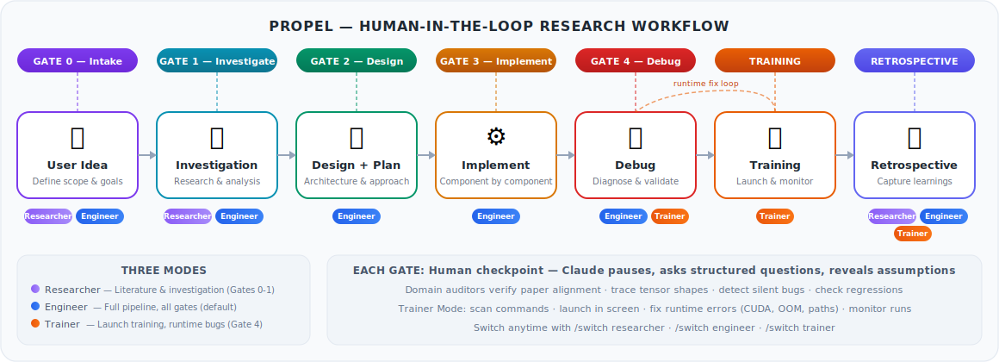

# Propel

A structured constraint framework for Claude Code in research workflows.

<p align="center">
  
</p>

## Why Constraints Matter

Claude Code can be a powerful boost to research workflows if we use it correctly and carefully. Without structure, an unconstrained LLM produces the mean of its training data — ask Claude to "implement RVQ" and you get a plausible-looking average of every RVQ implementation it has seen, not the one that matches your paper, your architecture, your constraints. The output compiles, but it's noisy: wrong assumptions baked in, silent numerical bugs, design decisions made without asking.

**The fix isn't better prompts — it's structured constraints.** This is the core insight behind [obra/superpowers](https://github.com/obra/superpowers): when we constrain an LLM with domain-specific rules, verification gates, and forced checkpoints, the output goes from "plausible average" to precisely what we need. Propel applies this to research workflows where the cost of undetected noise is highest — a silent broadcasting bug in a loss function doesn't crash, it produces subtly wrong training runs that waste compute.

## What Only You Can Provide

Propel's constraints are necessary but not sufficient. The framework forces Claude to stop and ask structured questions at every phase transition, but **the quality of the output depends entirely on what you bring to those checkpoints**:

- **Your research question** — not "implement X" but "test whether X improves Y under condition Z." The more specific you are, the less Claude has to guess.
- **Your hypothesis** — what do you expect to happen and why? This is what the auditors verify against. Without a target, Claude cannot tell you when it missed.
- **Your method** — which paper, which equations, which specific algorithmic choices? Claude cannot infer "use stop-gradient on the codebook as in Section 3.2" from context alone.
- **Your domain knowledge** — the pitfalls that aren't in any paper, the configurations that look correct but silently fail, the things that only work in your specific setup.

It is critical to review what Claude finds during investigation thoroughly — the investigation README is the blueprint for everything that follows. If the blueprint is correct, the code will be correct. Ask Claude to compare its proposals with what's in the paper, question why it made certain decisions, and have it introspect on its reasoning when something feels off.

Each gate is designed to extract your specific insight before Claude acts on it. Gate 0 asks your research intent, Gate 1 validates its understanding against yours, Gate 2 confirms the plan matches your method. Skipping these means accepting the noisy mean. The more specific your constraints, the less noise in the output.

### Encoding Your Domain Knowledge

Propel gives you three places to embed the expertise that makes the difference:

| Where | What to Put There | Why It Matters |
|-------|-------------------|----------------|
| **Project CLAUDE.md** | Research context, conventions, known pitfalls, what "correct" means for your project | Read on every session — sets the baseline constraints |
| **Custom agents** | Domain-specific auditors that check what matters in *your* field (see [customization](docs/customization.md)) | Automated verification tuned to your failure modes |
| **Gate 0 answers** | Your actual research question, hypothesis, success criteria, scope boundaries | The single biggest lever — this is where the mean becomes specific |

A generic "implement the loss function" gets you the average loss function. "Implement equation 7 from [paper], using stop-gradient on the codebook as in section 3.2, with straight-through estimator for the backward pass" gets you what you actually need.

## Three Modes

Not every session needs the full pipeline. Propel offers three modes that filter which skills and gates are active. Choose a mode at the start of each session (via `/intro` or `/switch`), or default to Engineer.

| Mode | Scope | Active Gates | When to Use |
|------|-------|-------------|-------------|
| **Researcher** | Literature, investigation, deep research | Gate 0, Gate 1 | Understanding the problem space — reading papers, tracing code, exploring approaches |
| **Engineer** | Full pipeline (default) | All (0-4) | Building something — investigation through implementation with all auditors |
| **Trainer** | Training execution, runtime debugging | Gate 4 (runtime only) | Code is ready — launching training runs, fixing CUDA/OOM/path errors |

- **Researcher Mode** keeps you in the understanding phase. Implementation skills are paused — if you try to build something, Propel suggests `/switch engineer`.
- **Engineer Mode** is the default and matches the existing full Propel workflow. Nothing changes if you always use this mode.
- **Trainer Mode** scans for training commands, launches them in screen sessions, and fixes runtime bugs. It does NOT touch training logic (architecture, loss, data pipeline) — for those, `/switch engineer`.

Switch anytime with `/switch researcher`, `/switch engineer`, or `/switch trainer`. Mode state persists in `.propel/mode.json` (gitignored) and survives `/clear`.

## How Propel Constrains

Propel enforces five human-in-the-loop gates, dispatches domain-specific auditors after every code change, and maintains living documentation across `/clear` boundaries.

### The Pipeline

The full pipeline has seven stages and five human-in-the-loop gates (see diagram above):

```
Intake → Investigation → Design → Implementation → Debug → Training → Retrospective
 G0          G1            G2          G3             G4      Trainer      All
```

- **Gates 0-1** (Researcher + Engineer): Scoping and investigation checkpoints
- **Gates 2-3** (Engineer only): Design approval and implementation auditing
- **Gate 4** (Engineer + Trainer): Debug diagnosis before applying fixes
- **Training** (Trainer Mode): Launch runs, monitor, fix runtime errors
- **Retrospective** (All modes): Capture learnings and failed attempts

At each gate, Claude stops and asks structured questions that reveal design assumptions — never "shall I proceed?" but "should we [A] or [B]? A means [trade-off], B means [trade-off]."

## Installation

```bash
# Clone and install
git clone https://github.com/KevinBian107/propel.git
cd propel && pip install -e .

# Initialize in any project
cd /path/to/your/project
propel init
```

`propel init` copies all skills, agents, commands, and hooks into your project's `.claude/` directory, configures the session-start hook in `settings.local.json`, and adds `scratch/`, `sessions/`, `.propel/`, `.claude/`, and `propel/` to `.gitignore`.

Then start Claude and run `/intro`. This introduces the framework, scans your codebase to draft a project-specific `.claude/CLAUDE.md`, and optionally builds a persistent project profile in `.propel/` that Claude references on every session — detecting code conventions, domain context, and development patterns automatically.

## Quick Start

See [docs/quickstart.md](docs/quickstart.md) for a 5-minute setup guide.

## Skills

| Category | Skill | Trigger |
|----------|-------|---------|
| **Meta** | [using-propel](skills/using-propel/SKILL.md) | Always active — routes to correct skill |
| **Literature** | [deep-research](skills/deep-research/SKILL.md) | "survey", "literature review", "compare methods" |
| | [paper-extraction](skills/paper-extraction/SKILL.md) | "process these papers", "build paper database" |
| **Investigation** | [investigation](skills/investigation/SKILL.md) | "start investigation", "trace X", "what touches X" |
| **Design** | [research-design](skills/research-design/SKILL.md) | "propose how to", "design the implementation" |
| | [writing-plans](skills/writing-plans/SKILL.md) | "write the plan", "break into tasks" |
| **Implementation** | [subagent-driven-research](skills/subagent-driven-research/SKILL.md) | User says "go" after plan approval |
| **Validation** | [research-validation](skills/research-validation/SKILL.md) | "validate this", "test the implementation" |
| | [verification-before-completion](skills/verification-before-completion/SKILL.md) | Before claiming "done" |
| **Debugging** | [systematic-debugging](skills/systematic-debugging/SKILL.md) | Bug reports, training failures |
| **Learning** | [retrospective](skills/retrospective/SKILL.md) | "retrospective", "capture learnings", auto-suggests at ~20 turns |
| **Cross-cutting** | [think-deeply](skills/think-deeply/SKILL.md) | Confirmation-seeking statements, leading questions |
| | [context-hygiene](skills/context-hygiene/SKILL.md) | >15 turns, "getting long" |
| | [using-git-worktrees](skills/using-git-worktrees/SKILL.md) | "create worktree", "experiment branch" |
| **Training** | [trainer-mode](skills/trainer-mode/SKILL.md) | "train", "launch training", "run training" (Trainer Mode) |
| **Customization** | [project-customization](skills/project-customization/SKILL.md) | "customize Propel", "analyze my project", "detect conventions" |

## Agents (Auditors)

| Agent | Purpose | Auto-dispatched? |
|-------|---------|-----------------|
| [paper-alignment-auditor](agents/paper-alignment-auditor.md) | Cross-reference code against paper equations | Yes — after paper-derived components |
| [jax-logic-auditor](agents/jax-logic-auditor.md) | Trace shapes through JAX transforms | Yes — after JAX code changes |
| [silent-bug-detector](agents/silent-bug-detector.md) | Scan for 11 silent failure categories | Yes — after model/loss/data changes |
| [data-flow-tracer](agents/data-flow-tracer.md) | End-to-end tensor annotation | No — explicit invocation |
| [regression-guard](agents/regression-guard.md) | Verify existing configs unchanged | Yes — after any code change |
| [env-researcher](agents/env-researcher.md) | Deep-dive simulation env docs (MuJoCo, robosuite, Isaac, etc.) | Yes — during investigation of env-dependent code |
| [failure-mode-researcher](agents/failure-mode-researcher.md) | Internet search for training failures | No — explicit invocation |
| [code-reviewer](agents/code-reviewer.md) | General code quality with research awareness | No — invoked during review stage |

## Commands (Slash Commands)

| Command | Purpose |
|---------|---------|
| [/intro](commands/intro.md) | [Propel] Introduction — lists all commands, skills, and agents |
| [/read-paper](commands/read-paper.md) | [Propel] Extract structured reference from a paper |
| [/debug-training](commands/debug-training.md) | [Propel] Diagnose training issues |
| [/trace-shapes](commands/trace-shapes.md) | [Propel] Quick shape annotation through a code path |
| [/primer](commands/primer.md) | [Propel] Load project context |
| [/switch](commands/switch.md) | [Propel] Switch between modes (researcher, engineer, trainer) |
| [/new-session](commands/new-session.md) | [Propel] Create and track a session |

## Session Management

```bash
# Create a new session and launch Claude Code
propel session launch "RVQ depth-2 rotation experiment"

# List past sessions
propel session list

# Save chat history
propel session save <session-id> <session-dir>
```

Sessions are stored in `sessions/` with chat history, prompt templates, and symlinks to investigation artifacts. See [docs/workflow.md](docs/workflow.md) for details.

## Documentation

- [Quick Start](docs/quickstart.md) — 5-minute setup
- [Full Workflow](docs/workflow.md) — Walkthrough with all 5 gates
- [Customization](docs/customization.md) — Adding project-specific agents/skills
- [Design Document](../propel/DESIGN.md) — Full specification (in code-manual repo)

## Acknowledgments

Propel combines ideas from multiple sources:

- **[obra/superpowers](https://github.com/obra/superpowers)** — Plugin architecture, discipline enforcement, verification gates, micro-task planning. Propel's plugin structure, hook system, and "check skills before acting" pattern come directly from Superpowers.

- **[code-manual](https://github.com/KevinBian107/code-manual)** — Research methodology, investigation skills, domain-specific agents, paper-alignment auditing, retrospective system. The investigation-first workflow, all auditor agents, and the literature skills originate from code-manual.

- **[scott-yj-yang/new-prompt](https://github.com/scott-yj-yang/new-prompt)** — Session management CLI. The `propel session` tool is adapted from new-prompt with auto-detection of project root, investigation artifact linking, and session indexing.

- **[Talmo's sleap-io](https://github.com/talmolab/sleap-io/blob/main/.claude/skills/investigation/SKILL.md?plain=1)** — Investigation skill template. The structured scratch/ investigation pattern with living READMEs originates from Talmo's sleap-io project.

- **[Sionic AI's experiment registry](https://huggingface.co/blog/sionic-ai/claude-code-skills-training)** — Retrospective skill and `/advise` + `/retrospective` workflow for capturing experiment learnings into a reusable registry.

- **[brunoasm's claude skills](https://github.com/brunoasm/my_claude_skills)** — Think-deeply anti-sycophancy skill and PDF extraction skill.

- **[Weizhena's Deep-Research workflow](https://github.com/Weizhena/Deep-Research-skills)** — Structured literature review with human-in-the-loop checkpoints.

- **[Context Engineering Template](https://github.com/coleam00/context-engineering-intro/blob/main/claude-code-full-guide/README.md)** — Basic Claude Code usage patterns and context engineering principles.

## License

MIT
