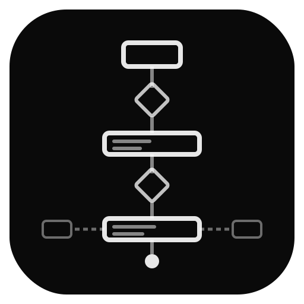
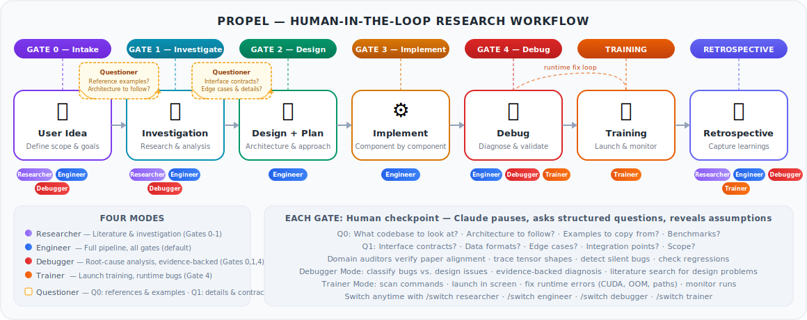

<p align="center">
  
</p>

# Propel

A structured constraint framework for Claude Code in research workflows.

**[Website](https://kbian.org/propel-website/)** | **[Documentation](https://kbian.org/propel-website/docs/)** | **[Vibe Coding Articles](https://kbian.org/Kaiwen-Wiki/articles/vibe_coding/)**

<p align="center">
  
</p>

## Why Propel?

Without structure, an unconstrained LLM produces the **mean of its training data**. Ask it to "implement RVQ" and you get a plausible-looking average — not the one matching your paper, your architecture, your constraints. The output compiles, but embeds wrong assumptions, silent numerical bugs, and design decisions made without asking.

**The fix isn't better prompts — it's structured constraints.** Propel enforces human-in-the-loop gates, domain-specific auditors, and investigation-first methodology so the output goes from "plausible average" to precisely what you need.

## Core Principles

| Principle | Rule |
|-----------|------|
| **Assistant, not agent** | Investigate and present — don't guess and act. Every claim traceable to evidence. |
| **Evidence over agreement** | Be correct, not agreeable. Steel-man the counterargument before agreeing. |
| **Context discipline** | Hallucination risk grows with context. Preserve state in living READMEs, clear proactively. |
| **Critical self-reflection** | Question your own reasoning as hard as the user's. |
| **Break logic loops** | Name circular reasoning, reframe, or bring new data. 3-strike limit. |

## Four Modes

| Mode | Active Gates | When to Use |
|------|-------------|-------------|
| **Researcher** | Gate 0, 1 | Understanding the problem space — papers, code tracing, approaches |
| **Engineer** | All (0–4) | Full pipeline from investigation through implementation (default) |
| **Debugger** | Gate 0, 1, 4 | Root-cause analysis — classify bugs vs. design issues with evidence |
| **Trainer** | Gate 4 (runtime) | Launch training, monitor, fix CUDA/OOM/path errors |

Switch anytime: `/switch researcher`, `/switch engineer`, `/switch debugger`, `/switch trainer`.

## Installation

```bash
git clone https://github.com/KevinBian107/propel.git
cd propel && pip install -e .

cd /path/to/your/project
propel init
```

Then start Claude and run `/intro` to select a mode and set up your project. See the [Getting Started guide](https://kbian.org/propel-website/docs/getting-started.html) for details.

## Documentation

Full documentation is available on the [Propel website](https://kbian.org/propel-website/docs/):

- [Getting Started](https://kbian.org/propel-website/docs/getting-started.html) — Installation and first workflow
- [Core Principles](https://kbian.org/propel-website/docs/core-principles.html) — The five non-negotiable principles
- [Pipeline](https://kbian.org/propel-website/docs/pipeline/) — Gates, questioners, and phase transitions
- [Modes](https://kbian.org/propel-website/docs/modes/) — Researcher, Engineer, Debugger, Trainer
- [Skills](https://kbian.org/propel-website/docs/skills/) — 17 specialized skills by workflow phase
- [Agents](https://kbian.org/propel-website/docs/agents/) — 8 domain-specific auditors
- [Customization](https://kbian.org/propel-website/docs/customization.html) — Project-specific agents, skills, commands
- [Common Pitfalls](https://kbian.org/propel-website/docs/pitfalls.html) — Known failure modes and anti-patterns

## Acknowledgments

Propel combines ideas from: [obra/superpowers](https://github.com/obra/superpowers), [scott-yj-yang/new-prompt](https://github.com/scott-yj-yang/new-prompt), [Talmo's sleap-io](https://github.com/talmolab/sleap-io), [Sionic AI](https://huggingface.co/blog/sionic-ai/claude-code-skills-training), [brunoasm's claude skills](https://github.com/brunoasm/my_claude_skills), [Weizhena's Deep-Research](https://github.com/Weizhena/Deep-Research-skills), and [Context Engineering Template](https://github.com/coleam00/context-engineering-intro).

## License

MIT — Built by [Kaiwen Bian](https://kbian.org) and [Yuer Tang](https://yuertang.dev/).
