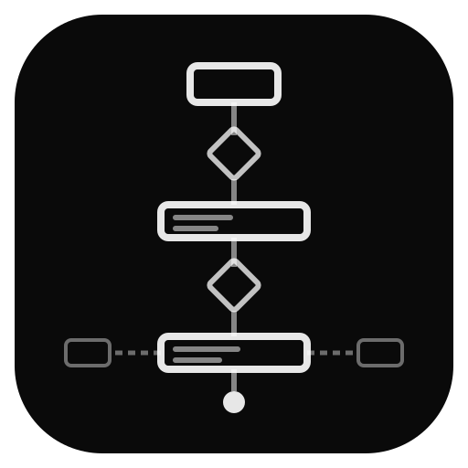
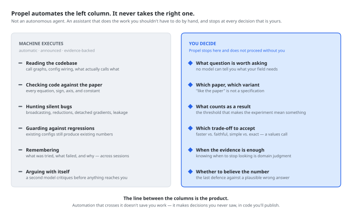
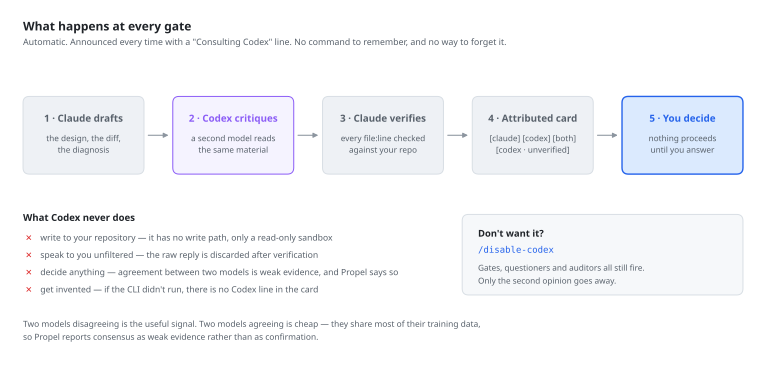
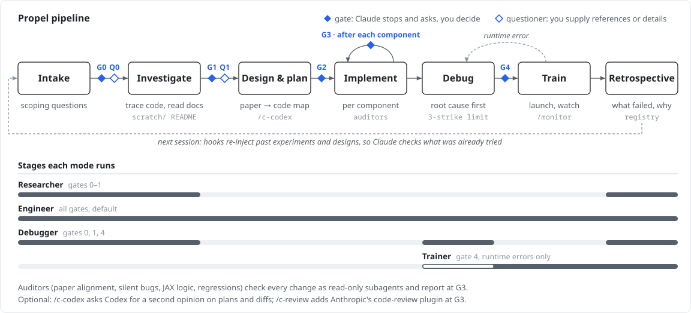
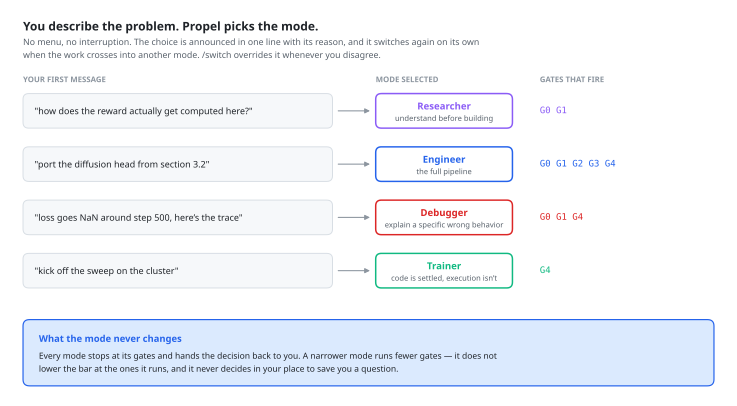

<p align="center">
  
</p>

# Propel

**Propel is not an autonomous agent.** It automates the tedious, mechanical half of
research engineering — tracing code, checking implementations against the paper,
hunting silent bugs, remembering what already failed — and it stops at every
decision that is actually yours.

You decide. The machines execute.

**[Website](https://kbian.org/propel-website/)** | **[Documentation](https://kbian.org/propel-website/docs/)** | **[Vibe Coding Articles](https://kbian.org/Kaiwen-Wiki/articles/vibe_coding/)**

<p align="center">
  
</p>

## Why Propel?

An unconstrained LLM writes the **mean of its training data**. Ask it to "add a
diffusion policy head" and you get a blend of every diffusion codebase it has
seen: a cosine noise schedule from one repo, ε-prediction from another, an EMA
decay from a third. The code runs. It may even train. But it is not the variant
your paper describes, and the choices that decide whether your experiment means
anything were made without asking you.

The fix is not a cleverer prompt. It is structure. Propel makes the agent
investigate before it writes code, stop at five gates to ask you design questions,
send every change past auditors that compare it against the paper, and consult a
second model — OpenAI Codex — before any of it reaches you. Each retrospective
feeds a working memory of past experiments that is loaded into the next session,
so the agent checks what was already tried before proposing it again.

This matters most in research code, where mistakes are quiet. A broadcasting bug
in a loss function doesn't crash. It gives you a training run whose numbers are
wrong, and a plot you believe.

## What You Don't Have to Do

| | |
|---|---|
| **Pick a mode** | Propel reads your first message, picks one, and says which and why |
| **Name a skill or an agent** | Describe the problem; the right investigation, auditors and reviewers get dispatched and announced |
| **Ask for a second opinion** | Codex is consulted at every major decision point, automatically, and every claim it makes is checked against your code |
| **Remember to run the auditors** | A hook names the required ones after every edit |

What's left for you is the part machines are worst at: deciding what to build,
what the result means, and which trade-off is right. Propel stops at every one of
those and does not proceed until you answer.

## Two Models at Every Decision

<p align="center">
  
</p>

A model reviewing its own plan is a model grading its own homework. Propel sends
the design, the diff, or the diagnosis to a second model with different training
biases, verifies every `file:line` it cites against your actual repository, and
presents an attributed card — `[claude]`, `[codex]`, `[both]`,
`[codex · unverified]` — so you can always tell who said what.

Codex advises. It never decides, never writes to your repo, and never speaks to
you unfiltered. Two models agreeing is reported as weak evidence, because it is.
Don't want it? `/disable-codex`.

**And you can check.** The announcement in the transcript is written by a model;
the ledger isn't. Every consult is appended to `.propel/codex-log.jsonl` by the
wrapper script itself, so a claimed consult with no entry didn't happen:

```bash
propel codex log                   # what was asked, when, and what came back
propel codex statusline --install  # live segment: codex * 3 . 7s
```

## The Pipeline

<p align="center">
  
</p>

## Core Principles

| Principle | Rule |
|-----------|------|
| **Assistant, not agent** | Investigate and present — don't guess and act. Every claim traceable to evidence. |
| **Evidence over agreement** | Be correct, not agreeable. Steel-man the counterargument before agreeing. |
| **Context discipline** | Hallucination risk grows with context. Preserve state in living READMEs, clear proactively. |
| **Critical self-reflection** | Question your own reasoning as hard as the user's. |
| **Break logic loops** | Name circular reasoning, reframe, or bring new data. 3-strike limit. |
| **Two models, one human** | Codex argues with Claude automatically. Neither of them decides. |

## Four Modes — selected automatically

<p align="center">
  
</p>

| Mode | Active Gates | Picked when |
|------|-------------|-------------|
| **Researcher** | Gate 0, 1 | The question is about the problem space, not the code |
| **Engineer** | All (0–4) | There is something to build (also the fallback) |
| **Debugger** | Gate 0, 1, 4 | There is a specific wrong behavior to explain |
| **Trainer** | Gate 4 (runtime) | The code is settled; the problem is execution |

Propel picks the mode from your first message, announces the choice in one line
with the reason, and switches again on its own when the work crosses a boundary.
Override any time: `/switch researcher`, `/switch engineer`, `/switch debugger`,
`/switch trainer`.

## Installation

```bash
git clone https://github.com/KevinBian107/propel.git
cd propel

pipx install -e .     # or: uv tool install -e .
propel                # opens the setup console
```

`pipx` (or `uv tool`) is the reliable route: it puts `propel` on your PATH in its
own environment, and the editable install means edits to the repo take effect
immediately. Plain `pip install -e .` also works **inside an activated virtualenv
or conda env** &mdash; but against a Homebrew or system Python it fails with
`externally-managed-environment`, or installs into somewhere not on your PATH, and
you end up with no `propel` command.

`propel` opens a local setup page that detects Claude Code, Codex, Node and git,
installs whatever is missing, opens a terminal for the two logins that genuinely
need one, and installs Propel into your project. Nothing leaves your machine
except the installers you click.

Prefer the command line?

```bash
cd /path/to/your/project
propel init
```

Then start `claude` and just describe what you're working on. See the
[Getting Started guide](https://kbian.org/propel-website/docs/getting-started.html)
for a full walkthrough.

## Documentation

Full documentation is on the [Propel website](https://kbian.org/propel-website/docs/):

- [Getting Started](https://kbian.org/propel-website/docs/getting-started.html) — Installation, the setup console, and your first workflow
- [Core Principles](https://kbian.org/propel-website/docs/core-principles.html) — The non-negotiable principles injected into every session
- [Automation](https://kbian.org/propel-website/docs/automation.html) — What dispatches itself, and what never will
- [Codex](https://kbian.org/propel-website/docs/codex.html) — The automatic dual-model layer
- [Pipeline](https://kbian.org/propel-website/docs/pipeline/) — Gates, questioners, and phase transitions
- [Modes](https://kbian.org/propel-website/docs/modes/) — Researcher, Engineer, Debugger, Trainer
- [Skills](https://kbian.org/propel-website/docs/skills/) — Specialized skills by workflow phase
- [Agents](https://kbian.org/propel-website/docs/agents/) — Auditors and worker subagents
- [Customization](https://kbian.org/propel-website/docs/customization.html) — Project-specific agents, skills, commands
- [Common Pitfalls](https://kbian.org/propel-website/docs/pitfalls.html) — Known failure modes and anti-patterns

## Figures

Every figure in this repository is generated by a script in [`figures/`](figures/),
one folder per figure, following the structure of
[ChenLiu-1996/figures4papers](https://github.com/ChenLiu-1996/figures4papers).
Regenerate them all with `python figures/make_all.py`. The SVGs in `assets/` are
build output — edit the script, not the SVG.

## Acknowledgments

Propel combines ideas from: [obra/superpowers](https://github.com/obra/superpowers), [scott-yj-yang/new-prompt](https://github.com/scott-yj-yang/new-prompt), [Talmo's sleap-io](https://github.com/talmolab/sleap-io), [Sionic AI](https://huggingface.co/blog/sionic-ai/claude-code-skills-training), [brunoasm's claude skills](https://github.com/brunoasm/my_claude_skills), [Weizhena's Deep-Research](https://github.com/Weizhena/Deep-Research-skills), and [Context Engineering Template](https://github.com/coleam00/context-engineering-intro).

Figure structure and publication-style conventions follow [ChenLiu-1996/figures4papers](https://github.com/ChenLiu-1996/figures4papers).

The dual-model layer drives the [OpenAI Codex CLI](https://developers.openai.com/codex/cli) directly. The [anthropics/claude-code code-review plugin](https://github.com/anthropics/claude-code/tree/main/plugins/code-review) is bridged by `/c-review`.

Skills vendored directly: [anthropics/skills — frontend-design](https://github.com/anthropics/skills/blob/main/skills/frontend-design/SKILL.md) (see source repo for LICENSE).

## License

MIT — Built by [Kaiwen Bian](https://kbian.org) and [Yuer Tang](https://yuertang.dev/).
